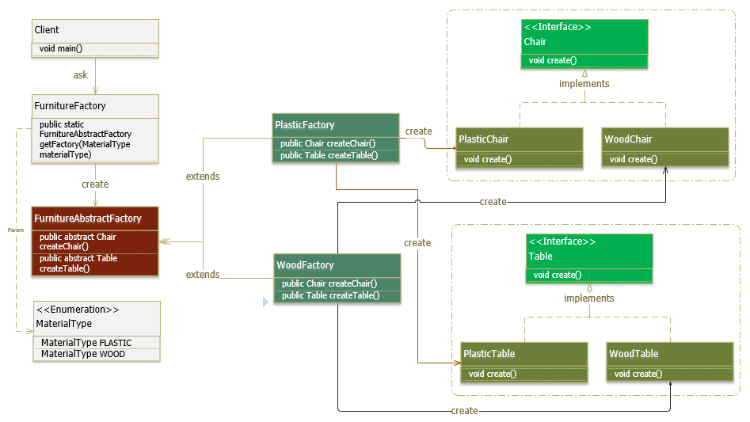

# 1. Abstract Factory Pattern là gì?
**Abstract Factory pattern** là một trong những **Creational pattern**. Nó là phương pháp tạo ra một **Super-factory** dùng để tạo ra các Factory khác. Hay còn được gọi là Factory của các Factory. Abstract Factory Pattern là một Pattern cấp cao hơn so với Factory Method Pattern.

Trong **Abstract Factory pattern**, một interface có nhiệm vụ tạo ra một Factory của các object có liên quan tới nhau mà không cần phải chỉ ra trực tiếp các class của object. Mỗi Factory được tạo ra có thể tạo ra các object bằng phương pháp giống như Factory pattern.

Hãy tưởng tượng, **Abstract factory** như là một nhà máy lớn chứa nhiều nhà máy nhỏ, trong các nhà máy đó có những xưởng sản xuất, các xưởng đó tạo ra những sản phẩm khác nhau.

# 2. Cài đặt Abstract Factory Pattern như thế nào?
Một Abstract Factory Pattern bao gồm các thành phần cơ bản sau:
* **AbstractFactory**: Khai báo dạng interface hoặc abstract class chứa các phương thức để tạo ra các đối tượng abstract.
* **ConcreteFactory**: Xây dựng, cài đặt các phương thức tạo các đối tượng cụ thể.
* **AbstractProduct**: Khai báo dạng interface hoặc abstract class để định nghĩa đối tượng abstract.
* **Product**: Cài đặt của các đối tượng cụ thể, cài đặt các phương thức được quy định tại AbstractProduct.
* **Client**: là đối tượng sử dụng AbstractFactory và các AbstractProduct.

_Ví dụ:_ 

Một công ty đồ nội thất chuyên sản xuất ghế (Chair): ghế nhựa (PlasticChair) và ghế gỗ (WoodChair). Với tình hình kinh doanh ngày càng thuận thợi nên công ty quyết định mở rộng thêm sản xuất bàn (Table). Với lợi thế là đã có kinh nghiệm từ sản xuất ghế nên công ty vẫn giữ chất liệu là nhựa (PlasticTable) và gỗ (WoodTable) cho sản xuất bàn. Tuy nhiên, quy trình sản xuất ghế/ bàn theo từng chất liệu (MaterialType) là khác nhau. Nên công ty tách ra là nhà máy (Factory): 1 cho sản xuất vật liệu bằng nhựa (PlasticFactory), 1 cho sản xuất vật liệu bằng gỗ (WoodFactory), nhưng cả 2 đều có thể sản xuất ghế và bàn (FunitureAbstractFactory). Khi khách hàng cần mua một món đồ nào, khách hàng (Client) chỉ cần đến cửa hàng để mua (FunitureFactory). Khi đó ứng với từng hàng hóa và vật liệu sẽ được chuyển về phân xưởng tương ứng để sản xuất (createXXX) ra bàn (Table) và ghế (Chair).

_Chương trình được cài đặt theo Abstract Factory Pattern như sau:_

**AbstractProduct và Product:**
- Tôi cứ tạo 1 Interface Chair và có 1 hàm Create. Việc Create như nào thì do các lớp implements tự đi mà Create. Ông A thích Create theo kiểu A, ông B thích Create theo kiểu B cái đó tôi không quan tâm, Điều quan trọng là đã implements từ tôi thì phải thực hiện khơi tạo Hàm Create
```
package com.gpcoder.patterns.creational.abstractfactory.chair;
public interface Chair {
    void create();
}
```
- Tiếp theo tôi tạo 2 class WoodChair, PlasticChair implements interface Chair.Trong đó ông WoodChair  sẽ tạo ha Create theo cách của WoodChair , Còn PlasticChair  sẽ tạo hàm Create theo cách của PlasticChair.
```package com.gpcoder.patterns.creational.abstractfactory.chair;
 
public class PlasticChair implements Chair {
    @Override
    public void create() {
        System.out.println("Tôi cấu hình hàm Create theo cách PlasticChair");
    }
}
```
```
package com.gpcoder.patterns.creational.abstractfactory.chair;
public class WoodChair implements Chair {
    @Override
    public void create() {
        System.out.println("Tôi cấu hình hàm Create theo cách WoodChair");
    }
}
```

* Tương tự tôi tạo ra interface Table và 2 class PlasticTable, WoodTable  implements Table
```
package com.gpcoder.patterns.creational.abstractfactory.table;
public interface Table {
    void create();
}
```
```
package com.gpcoder.patterns.creational.abstractfactory.table;
public class PlasticTable implements Table {
    @Override
    public void create() {
        System.out.println("Create plastic table");
    }
}
```
```
package com.gpcoder.patterns.creational.abstractfactory.table;
public class WoodTable implements Table {
    @Override
    public void create() {
        System.out.println("Create wood table");
    }
}
```
**AbstractFactory:**

* Giờ tôi tạo FurnitureAbstractFactory có 2 hàm createChair có kiểu là Chair. Do kiểu Chair là 1 interface và hãy nhớ rắng tôi đang có 2 class implement interface này. tương tự hàm createTable cũng vậy. Hàm này là 1 abstract tối chỉ khai báo thôi chứ không khởi tạo, tôi sẽ để những thằng nào extends từ tôi thì đi mà khơi tạo, Lúc đấy nó thích trả về PlasticChair hay WoodChair đấy là việc của Class con tự đi mà làm. (tính đa hình trong OOP)
```
package com.gpcoder.patterns.creational.abstractfactory.factory; 
import com.gpcoder.patterns.creational.abstractfactory.chair.Chair;
import com.gpcoder.patterns.creational.abstractfactory.table.Table;
 
public abstract class FurnitureAbstractFactory {
    public abstract Chair createChair();
    public abstract Table createTable();
     
}
```
**ConcreteFactory:**

* Giờ tôi tạo 2 class extends cái FurnitureAbstractFactory
```
package com.gpcoder.patterns.creational.abstractfactory.factory.impl;
 
import com.gpcoder.patterns.creational.abstractfactory.chair.Chair;
import com.gpcoder.patterns.creational.abstractfactory.chair.PlasticChair;
import com.gpcoder.patterns.creational.abstractfactory.factory.FurnitureAbstractFactory;
import com.gpcoder.patterns.creational.abstractfactory.table.PlasticTable;
import com.gpcoder.patterns.creational.abstractfactory.table.Table;
 
public class FlasticFactory extends FurnitureAbstractFactory {
 
    @Override
    public Chair createChair() {
        return new PlasticChair();
    }
 
    @Override
    public Table createTable() {
        return new PlasticTable();
    }
 
}
```
```
package com.gpcoder.patterns.creational.abstractfactory.factory.impl;
 
import com.gpcoder.patterns.creational.abstractfactory.chair.Chair;
import com.gpcoder.patterns.creational.abstractfactory.chair.WoodChair;
import com.gpcoder.patterns.creational.abstractfactory.factory.FurnitureAbstractFactory;
import com.gpcoder.patterns.creational.abstractfactory.table.Table;
import com.gpcoder.patterns.creational.abstractfactory.table.WoodTable;
 
public class WoodFactory extends FurnitureAbstractFactory {
 
    @Override
    public Chair createChair() {
        return new WoodChair();
    }
 
    @Override
    public Table createTable() {
        return new WoodTable();
    }
}
```
* Đó thấy chưa, thằng mào   extends FurnitureAbstractFactory thì đi mà định  nghĩa 2 function mà FurnitureAbstractFactory đã khai bao.
* Ổn rồi đấy. giờ Xưởng tôi sản xuất bàn, ghế lãi quá muốn sản xuất máy bay, xe tăng . thì chỉ cần tạo thêm interface maybay, xetang. Việc tôi tạo ra các interface này chạy ảnh hưởng gì tới cái chair và table cả, nó vẫn chạt bình thường kể cả interface maybay có bị lỗi hay không , mỗin người 1 công 1 việc chả đụng chạm gì tới ai

**Tạo ra cái Enum cho nó gọn** 
```
public enum MaterialType {
    FLASTIC, WOOD
}
```
**Super Factory Class:**
```
package com.gpcoder.patterns.creational.abstractfactory.factory;
 
import com.gpcoder.patterns.creational.abstractfactory.MaterialType;
import com.gpcoder.patterns.creational.abstractfactory.factory.impl.FlasticFactory;
import com.gpcoder.patterns.creational.abstractfactory.factory.impl.WoodFactory;
 
public class FurnitureFactory {
 
    private FurnitureFactory() {
 
    }
 
    // Returns a concrete factory object that is an instance of the
    // concrete factory class appropriate for the given architecture.
    public static FurnitureAbstractFactory getFactory(MaterialType materialType) {
        switch (materialType) {
        case FLASTIC:
            return new FlasticFactory();
        case WOOD:
            return new WoodFactory();
        default:
            throw new UnsupportedOperationException("This furniture is unsupported ");
        }
    }
}
```
**Client:**
```
package com.gpcoder.patterns.creational.abstractfactory;
 
import com.gpcoder.patterns.creational.abstractfactory.chair.Chair;
import com.gpcoder.patterns.creational.abstractfactory.factory.FurnitureAbstractFactory;
import com.gpcoder.patterns.creational.abstractfactory.factory.FurnitureFactory;
import com.gpcoder.patterns.creational.abstractfactory.table.Table;
 
public class Client {
 
    public static void main(String[] args) {
 
        FurnitureAbstractFactory factory = FurnitureFactory.getFactory(MaterialType.FLASTIC);
 
        Chair chair = factory.createChair();
        chair.create(); // Create plastic chair
 
        Table table = factory.createTable();
        table.create(); // Create plastic table
    }
}
```
* Như bạn thấy, phía Client chỉ cần gọi phương thức FurnitureFactory.getFactory() là có thể sử dụng được các dịch vụ của một Factory bất kỳ.
* Khi hệ thống phát triển cần mở rộng thêm 1 nhà máy khác, chẳng hạn sản xuất hàng hóa bằng inox, thì đơn giản cần tạo thêm một class mới implement từ FurnitureAbstractFactory, và thêm vào logic khởi tạo Funiture trong FurnitureFactory. Nó không làm ảnh hưởng đến code ở phía Client.

# 3. Sử dụng Factory Pattern khi nào?

  Factory Pattern được sử dụng khi:

* Chúng ta có một super class với nhiều class con và dựa trên đầu vào, chúng ta cần trả về một class con. Mô hình này giúp chúng ta đưa trách nhiệm của việc khởi tạo một lớp từ phía người dùng (client) sang lớp Factory.
* Chúng ta không biết sau này sẽ cần đến những lớp con nào nữa. Khi cần mở rộng, hãy tạo ra sub class và implement thêm vào factory method cho việc khởi tạo sub class này.
* Lợi ích của Factory Pattern là gì?

# 4. Lợi ích của Factory Pattern:
* 
* Factory Pattern giúp giảm sự phụ thuộc giữa các module (loose coupling): cung cấp 1 hướng tiếp cận với Interface thay thì các implement. Giúp chuơng trình độc lập với những lớp cụ thể mà chúng ta cần tạo 1 đối tượng, code ở phía client không bị ảnh hưởng khi thay đổi logic ở factory hay sub class.
* Mở rộng code dễ dàng hơn: khi cần mở rộng, chỉ việc tạo ra sub class và implement thêm vào factory method.
* Khởi tạo các Objects mà che giấu đi xử lí logic của việc khởi tạo đấy. Người dùng không biết logic thực sực được khởi tạo bên dưới phương thức factory.
* Dễ dạng quản lý life cycle của các Object được tạo bởi Factory Pattern.
* Thống nhất về naming convention: giúp cho các developer có thể hiểu về cấu trúc source code.

* Bạn có thể thấy Factory Pattern được áp dụng trong:

* JDK: java.util.Calendar, ResourceBundle, NumberFormat, …
* BeanFactory trong Spring Framework.
* SessionFactory trong Hibernate Framework.
* …
