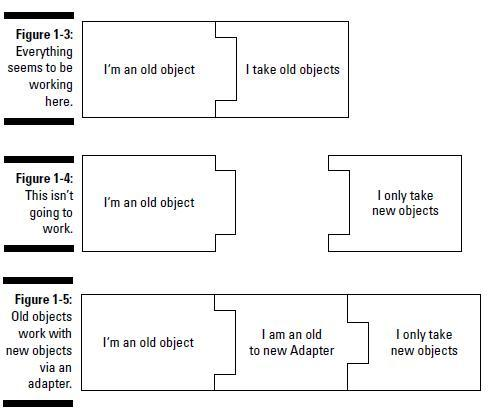
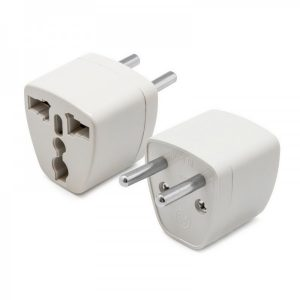
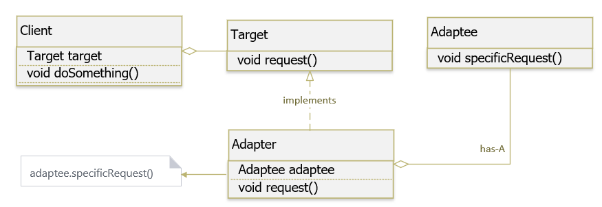
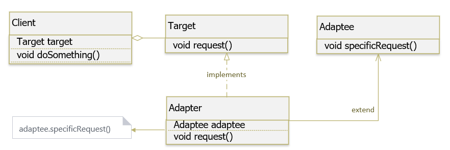
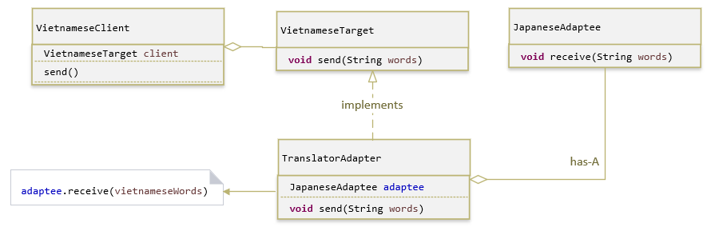
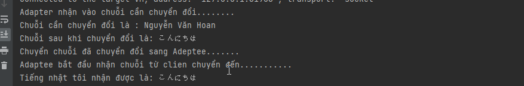

# **1. Adapter Pattern là gì?**
**Adapter Pattern** (Người chuyển đổi) là một trong những Pattern thuộc nhóm cấu trúc (**Structural Pattern**). Adapter Pattern cho phép các inteface (giao diện) không liên quan tới nhau có thể làm việc cùng nhau. Đối tượng giúp kết nối các interface gọi là Adapter.

**Adapter Pattern** giữ vai trò trung gian giữa hai lớp, chuyển đổi interface của một hay nhiều lớp có sẵn thành một interface khác, thích hợp cho lớp đang viết. Điều này cho phép các lớp có các interface khác nhau có thể dễ dàng giao tiếp tốt với nhau thông qua interface trung gian, không cần thay đổi code của lớp có sẵn cũng như lớp đang viết.


Adapter Pattern còn gọi là Wrapper Pattern do cung cấp một interface “bọc ngoài” tương thích cho một hệ thống có sẵn, có dữ liệu và hành vi phù hợp nhưng có interface không tương thích với lớp đang viết.

_Ví dụ:_
* Cái phích cắm điện có 3 chân nhưng ổ điện chỉ có 2 lỗ thì phải dùng thêm 1 cái bộ chuyển để chuyển từ 3 chân sang 2 chân – bộ chuyển này cũng được gọi là Adapter.



# **2. Cài đặt Adapter Pattern như thế nào?**
_Một Adapter Pattern bao gồm các thành phần cơ bản sau:_
* **Adaptee:** định nghĩa interface không tương thích, cần được tích hợp vào.
* **Adapter:** lớp tích hợp, giúp interface không tương thích tích hợp được với interface đang làm việc. Thực hiện việc chuyển đổi interface cho Adaptee và kết nối Adaptee với Client.
* **Target:** một interface chứa các chức năng được sử dụng bởi Client (domain specific).
* **Client:** lớp sử dụng các đối tượng có interface Target. 

_Có hai cách để thực hiện Adapter Pattern dựa theo cách cài đặt (implement) của chúng:_

* **Object Adapter – Composition (Chứa trong)**: trong mô hình này, một lớp mới (Adapter) sẽ tham chiếu đến một (hoặc nhiều) đối tượng của lớp có sẵn với interface không tương thích (Adaptee), đồng thời cài đặt interface mà người dùng mong muốn (Target). Trong lớp mới này, khi cài đặt các phương thức của interface người dùng mong muốn, sẽ gọi phương thức cần thiết thông qua đối tượng thuộc lớp có interface không tương thích.



* **Class Adapter – Inheritance (Kế thừa)** : trong mô hình này, một lớp mới (Adapter) sẽ kế thừa lớp có sẵn với interface không tương thích (Adaptee), đồng thời cài đặt interface mà người dùng mong muốn (Target). Trong lớp mới, khi cài đặt các phương thức của interface người dùng mong muốn, phương thức này sẽ gọi các phương thức cần thiết mà nó thừa kế được từ lớp có interface không tương thích.



_So sánh Class Adapter với Object Adapter:_

* Sự khác biệt chính là Class Adapter sử dụng Inheritance (kế thừa) để kết nối Adapter và Adaptee trong khi Object Adapter sử dụng Composition (chứa trong) để kết nối Adapter và Adaptee.
* Trong cách tiếp cận Class Adapter, nếu một Adaptee là một class và không phải là một interface thì Adapter sẽ là một lớp con của Adaptee. Do đó, nó sẽ không phục vụ tất cả các lớp con khác theo cùng một cách vì Adapter là một lớp phụ cụ thể của Adaptee.

_Tại sao Object Adapter lại tốt hơn?_

* Nó sử dụng Composition để giữ một thể hiện của Adaptee, cho phép một Adapter hoạt động với nhiều Adaptee nếu cần thiết.

## **2.1 Ví dụ Adapter Pattern với ứng dụng Translation**
Một người Việt muốn trao đổi với một người Nhật. Tuy nhiên, 2 người này không biết ngôn ngữ của nhau nên cần phải có một người để chuyển đổi từ ngôn ngữ tiếng Việt sang ngôn ngữ tiếng Nhật. Chúng ta sẽ mô hình hóa trường hợp này với Adapter Pattern như sau:

* **Client**: người Việt sẽ là Client trong ví dụ này,vì anh ta cần gửi một số message cho người Nhật.
* **Target**: đây là nội dung message được Client cung cấp cho thông dịch viên (Translator / Adapter).
* **Adapter**: thông dịch viên (Translator) sẽ là Adapter, nhận message tiếng Việt từ Client và chuyển đổi nó sang tiếng Nhật trước khi gởi cho người Nhật.
* **Adaptee**: đây là interface hoặc class được người Nhật sử dụng để nhận message được chuyển đổi từ thông dịch viên (Translator).



Code trong project nhé.
```
package org.example.Target;

public interface ITarget {
    void  Send(String chuoicanchuyendoi);
}
```
```
package org.example.Adapter;

import org.example.Adeptee.JapanseAdaptee;
import org.example.Target.ITarget;

public class JapanseAdapter implements ITarget {
    JapanseAdaptee japanseAdaptee;

    public JapanseAdapter(JapanseAdaptee japanseAdaptee) {
        this.japanseAdaptee = japanseAdaptee;
    }

    @Override
    public void Send(String chuoicanchuyendoi) {
        System.out.println("Adapter nhận vào chuỗi cần chuyển đổi........");
        System.out.println("Chuỗi cần chuyển đổi là : " + chuoicanchuyendoi);
        System.out.println("Chuỗi sau khi chuyển đổi là: " + this.Chuyendoingonngu(chuoicanchuyendoi));
        System.out.println("Chuyển chuỗi đã chuyển đổi sang Adeptee.......");
        japanseAdaptee.Recive(this.Chuyendoingonngu(chuoicanchuyendoi));
    }

    private String Chuyendoingonngu(String chuoichuyendoi) {
        return "こんにちは";
    }
}

```
```
package org.example.Adeptee;

public class JapanseAdaptee {
    //Chỉ nhận vào String là tiếng nhật, không nhận bất cứ tiếng nào khác
    public void Recive(String tiengnhat) {
        System.out.println("Adaptee bắt đầu nhận chuỗi từ clien chuyển đến...........");
        System.out.println("Tiếng nhật tôi nhận được là: " + tiengnhat);
    }
}

```
```
package org.example.Clinets;

import org.example.Adapter.JapanseAdapter;
import org.example.Adeptee.JapanseAdaptee;
import org.example.Target.ITarget;

public class Client {
    public void Send(String tiengvietcansend)
    {
       // JapanseAdaptee japanseAdaptee = new JapanseAdaptee();
       // japanseAdaptee.Recive(tiengvietcansend);
        // Lỗi Recive của JapanseAdaptee, chỉ nhận đầu vào là 1 String tiếng nhật
        ITarget iTarget = new JapanseAdapter(new JapanseAdaptee());
        iTarget.Send(tiengvietcansend);

    }
}

```
```
package org.example.EnumType;

public enum NgonNgu {
    TiengAnh, TiengNhat, TiengHan;
}

```
_Kết quả:_



## **2.2. Ví dụ Adapter Pattern với BufferedReader**
```
BufferedReader br = new BufferedReader(new InputStreamReader(System.in));
System.out.print("Enter your name: ");
String s = br.readLine();
```

_Như bạn thấy:_

* System.in: đây là một Adaptee. System.in là một static instance của lớp InputStream, nó đọc dữ liệu từ Console và trả về 1 byte stream.
* BufferedReader : đây là Target, nó chấp nhận dữ liệu là một character stream.
* InputStreamReader : đây là một Adapter ở giữa hai interface không tương thích: System.in và BufferedReader giúp cho chúng có thể hoạt động được với nhau.
* Client: là ứng dụng sẽ làm việc với Target interface.

# **3. Lợi ích của Adapter Pattern là gì?**
_Việc sử dụng Adapter Pattern đem lại các lợi ích sau:_

* Cho phép nhiều đối tượng có interface giao tiếp khác nhau có thể tương tác và giao tiếp với nhau.
* Tăng khả năng sử dụng lại thư viện với interface không thay đổi do không có mã nguồn.
* Bên cạnh những lợi ích trên, nó cũng nó một số khuyết điểm nhỏ sau:
* 
* Tất cả các yêu cầu được chuyển tiếp, do đó làm tăng thêm một ít chi phí.
* Đôi khi có quá nhiều Adapter được thiết kế trong một chuỗi Adapter (chain) trước khi đến được yêu cầu thực sự.

# **4. Sử dụng Adapter Pattern khi nào?**
_Có thể dùng Adapter Pattern trong những trường hợp sau:_

* Adapter Pattern giúp nhiều lớp có thể làm việc với nhau dễ dàng mà bình thường không thể. Một trường hợp thường gặp phải và có thể áp dụng Adapter Pattern là khi không thể kế thừa lớp A, nhưng muốn một lớp B có những xử lý tương tự như lớp A. Khi đó chúng ta có thể cài đặt B theo Object Adapter, các xử lý của B sẽ gọi những xử lý của A khi cần.
* Khi muốn sử dụng một lớp đã tồn tại trước đó nhưng interface sử dụng không phù hợp như mong muốn.
* Khi muốn tạo ra những lớp có khả năng sử dụng lại, chúng phối hợp với các lớp không liên quan hay những lớp không thể đoán trước được và những lớp này không có những interface tương thích.
* Cần phải có sự chuyển đổi interface từ nhiều nguồn khác nhau.
* Khi cần đảm bảo nguyên tắc Open/ Close trong một ứng dụng.