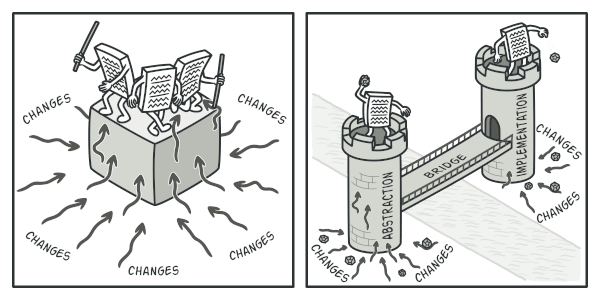
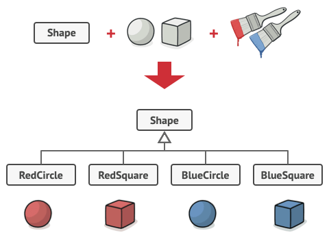
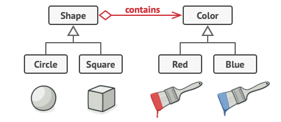
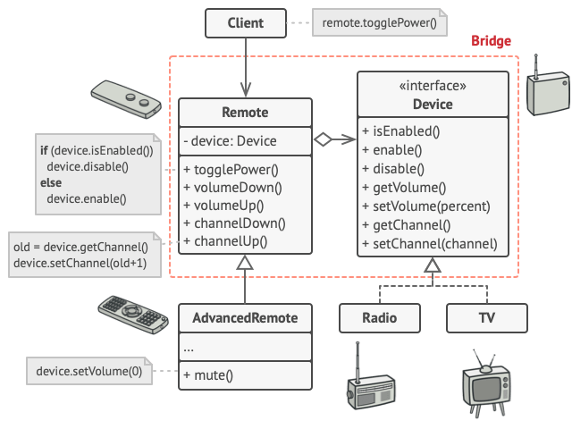
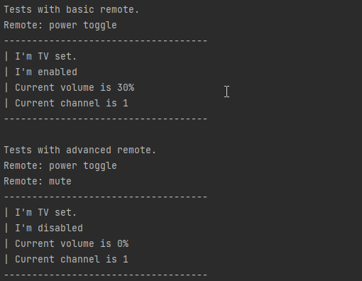

# **1. Bridge Pattern là gì?**
**Bridge Pattern** là một trong những Pattern thuộc nhóm cấu trúc (Structural Pattern). Ý tưởng của nó là tách tính trừu tượng (abstraction) ra khỏi tính hiện thực (implementation) của nó. Từ đó có thể dễ dàng chỉnh sửa hoặc thay thế mà không làm ảnh hưởng đến những nơi có sử dụng lớp ban đầu.

Điều đó có nghĩa là, ban đầu chúng ta thiết kế một class với rất nhiều xử lý, bây giờ chúng ta không muốn để những xử lý đó trong class đó nữa. Vì thế, chúng ta sẽ tạo ra một class khác và move các xử lý đó qua class mới. Khi đó, trong lớp cũ sẽ giữ một đối tượng thuộc về lớp mới, và đối tượng này sẽ chịu trách nhiệm xử lý thay cho lớp ban đầu.

**Bridge Pattern** khá giống với mẫu **Adapter Pattern** ở chỗ là sẽ nhờ vào một lớp khác để thực hiện một số xử lý nào đó. Tuy nhiên, ý nghĩa và mục đích sử dụng của hai mẫu thiết kế này hoàn toàn khác nhau:

* **Adapter Pattern** hay còn gọi là **Wrapper pattern** được dùng để biến đổi một class/ interface sang một dạng khác có thể sử dụng được. Adapter Pattern giúp các lớp không tương thích hoạt động cùng nhau mà bình thường là không thể.
* **Bridge Pattern** được sử dụng được sử dụng để tách thành phần trừu tượng (abstraction) và thành phần thực thi (implementation) riêng biệt.
* **Adapter Pattern** làm cho mọi thứ có thể hoạt động với nhau sau khi chúng đã được thiết kế (đã tồn tại). Bridge Pattern nên được thiết kế trước khi phát triển hệ thống để Abstraction và Implementation có thể thực hiện một cách độc lập.


## 1.1. Giả sử vấn để
Giả sử bạn có một **Shape** (lớp hình học) với một cặp lớp con: **Circle** và **Square**. Bạn muốn mở rộng hệ thống phân cấp lớp này để kết hợp các màu sắc, vì vậy bạn dự định tạo **Red** và **Blue** định hình các lớp con. Tuy nhiên, vì bạn đã có hai lớp con nên bạn sẽ cần tạo bốn tổ hợp lớp như **BlueCircle** và **RedSquare**.


Việc thêm các loại hình dạng và màu sắc mới vào hệ thống phân cấp sẽ phát triển nó theo cấp số nhân. Ví dụ: để thêm hình tam giác, bạn cần giới thiệu hai lớp con, mỗi lớp cho mỗi màu. Và sau đó, việc thêm một màu mới sẽ yêu cầu tạo ba lớp con, một lớp cho mỗi loại hình dạng. Chúng ta càng đi xa, nó càng trở nên tồi tệ hơn.

## **1.2. Gải pháp**
Sự cố này xảy ra vì chúng tôi đang cố gắng mở rộng các lớp hình dạng theo hai chiều độc lập: theo hình thức và theo màu sắc. Đó là một vấn đề rất phổ biến với kế thừa lớp

**Bridge Pattern** cố gắng giải quyết vấn đề này bằng cách chuyển từ kế thừa sang thành phần đối tượng. Điều này có nghĩa là bạn trích xuất một trong các thứ nguyên thành một hệ thống phân cấp lớp riêng biệt, sao cho các lớp ban đầu sẽ tham chiếu đến một đối tượng của hệ thống phân cấp mới, thay vì có tất cả trạng thái và hành vi của nó trong một lớp.



Theo cách tiếp cận này, chúng ta có thể trích xuất mã liên quan đến màu sắc vào lớp riêng của nó với hai lớp con: **Red** và **Blue**. Sau đó, lớp **Shape** sẽ nhận được một trường tham chiếu trỏ đến một trong các đối tượng màu. Bây giờ, hình dạng có thể ủy quyền bất kỳ công việc nào liên quan đến màu sắc cho đối tượng màu được liên kết. Tham chiếu đó sẽ đóng vai trò là cầu nối giữa các lớp **Shape** và **Color**. Từ giờ trở đi, việc thêm màu mới sẽ không yêu cầu thay đổi cấu trúc phân cấp hình dạng và ngược lại.
# **2. Cài đặt Bridge Pattern như thế nào?**


_Một Bridge Pattern bao gồm các thành phần sau:_
* **Client:** đại diện cho khách hàng sử dụng các chức năng thông qua **Abstraction**.
* **Abstraction :** định ra một abstract interface quản lý việc tham chiếu đến đối tượng hiện thực cụ thể (Implementor).
* **Refined Abstraction (AbstractionImpl) :** hiện thực (implement) các phương thức đã được định ra trong Abstraction bằng cách sử dụng một tham chiếu đến một đối tượng của Implementer.
* **Implementor :** định ra các interface cho các lớp hiện thực. Thông thường nó là interface định ra các tác vụ nào đó của Abstraction.
* **ConcreteImplementor :** hiện thực **Implementor** interface.

_Ví dụ:_

Ví dụ này minh họa cách mẫu **Brigge Pattern** có thể giúp phân chia mã nguyên khối của ứng dụng quản lý thiết bị và điều khiển từ xa của chúng. Các Device lớp đóng vai trò triển khai, trong khi các Remotelớp đóng vai trò trừu tượng hóa.

_Implementor_
```
package org.example.Implementor;

public interface Deceive {
    boolean isEnabled();

    void enable();

    void disable();

    int getVolume();

    void setVolume(int percent);

    int getChannel();

    void setChannel(int channel);

    void printStatus();
}

```
_ConcreteImplementor_
```
package org.example.ConcreteImplementor;

import org.example.Implementor.Deceive;

public class Radio implements Deceive {
    private boolean on = false;
    private int volume = 30;
    private int channel = 1;

    @Override
    public boolean isEnabled() {
        return on;
    }

    @Override
    public void enable() {
        on = true;
    }

    @Override
    public void disable() {
        on = false;
    }

    @Override
    public int getVolume() {
        return volume;
    }

    @Override
    public void setVolume(int volume) {
        if (volume > 100) {
            this.volume = 100;
        } else if (volume < 0) {
            this.volume = 0;
        } else {
            this.volume = volume;
        }
    }

    @Override
    public int getChannel() {
        return channel;
    }

    @Override
    public void setChannel(int channel) {
        this.channel = channel;
    }

    @Override
    public void printStatus() {
        System.out.println("------------------------------------");
        System.out.println("| I'm radio.");
        System.out.println("| I'm " + (on ? "enabled" : "disabled"));
        System.out.println("| Current volume is " + volume + "%");
        System.out.println("| Current channel is " + channel);
        System.out.println("------------------------------------\n");
    }
}

```
```
package org.example.ConcreteImplementor;

import org.example.Implementor.Deceive;

public class TV implements Deceive {
    private boolean on = false;
    private int volume = 30;
    private int channel = 1;

    @Override
    public boolean isEnabled() {
        return on;
    }

    @Override
    public void enable() {
        on = true;
    }

    @Override
    public void disable() {
        on = false;
    }

    @Override
    public int getVolume() {
        return volume;
    }

    @Override
    public void setVolume(int volume) {
        if (volume > 100) {
            this.volume = 100;
        } else if (volume < 0) {
            this.volume = 0;
        } else {
            this.volume = volume;
        }
    }

    @Override
    public int getChannel() {
        return channel;
    }

    @Override
    public void setChannel(int channel) {
        this.channel = channel;
    }

    @Override
    public void printStatus() {
        System.out.println("------------------------------------");
        System.out.println("| I'm TV set.");
        System.out.println("| I'm " + (on ? "enabled" : "disabled"));
        System.out.println("| Current volume is " + volume + "%");
        System.out.println("| Current channel is " + channel);
        System.out.println("------------------------------------\n");
    }
}

```
_AbstractionImpl_
```
package org.example.AbstractionImpl;

import org.example.Implementor.Deceive;

public class AdvancedRemote extends BasicRemote {
    public AdvancedRemote(Deceive device) {
        super.device = device;
    }

    public void mute() {
        System.out.println("Remote: mute");
        device.setVolume(0);
    }
}

```
```
package org.example.AbstractionImpl;

import org.example.Abstraction.Abstraction;
import org.example.Implementor.Deceive;

public class BasicRemote implements Abstraction {
    protected Deceive device;

    public BasicRemote() {}

    public BasicRemote(Deceive device) {
        this.device = device;
    }

    @Override
    public void power() {
        System.out.println("Remote: power toggle");
        if (device.isEnabled()) {
            device.disable();
        } else {
            device.enable();
        }
    }

    @Override
    public void volumeDown() {
        System.out.println("Remote: volume down");
        device.setVolume(device.getVolume() - 10);
    }

    @Override
    public void volumeUp() {
        System.out.println("Remote: volume up");
        device.setVolume(device.getVolume() + 10);
    }

    @Override
    public void channelDown() {
        System.out.println("Remote: channel down");
        device.setChannel(device.getChannel() - 1);
    }

    @Override
    public void channelUp() {
        System.out.println("Remote: channel up");
        device.setChannel(device.getChannel() + 1);
    }
}

```
_Abstraction_
```
package org.example.Abstraction;

public interface Abstraction {
    void power();

    void volumeDown();

    void volumeUp();

    void channelDown();

    void channelUp();
}

```
_Client_
```
package org.example.Client;

import org.example.AbstractionImpl.AdvancedRemote;
import org.example.AbstractionImpl.BasicRemote;
import org.example.Implementor.Deceive;

public class Client {
    public static void testDevice(Deceive device) {
        System.out.println("Tests with basic remote.");
        BasicRemote basicRemote = new BasicRemote(device);
        basicRemote.power();
        device.printStatus();

        System.out.println("Tests with advanced remote.");
        AdvancedRemote advancedRemote = new AdvancedRemote(device);
        advancedRemote.power();
        advancedRemote.mute();
        device.printStatus();
    }
}

```
_Output của chương trình trên:_



# **3. Lợi ích của Bridge Pattern là gì?**
* Giảm sự phục thuộc giữa **abstraction** và **implementation** (loose coupling): tính kế thừa trong OOP thường gắn chặt **abstraction** và **implementation** lúc build chương trình. **Bridge Pattern** có thể được dùng để cắt đứt sự phụ thuộc này và cho phép chúng ta chọn **implementation** phù hợp lúc runtime.

* **Giảm số lượng những lớp con không cần thiết**: một số trường hợp sử dụng tính inheritance sẽ tăng số lượng subclass rất nhiều. Ví dụ: trường hợp chương trình view hình ảnh trên các hệ điều hành khác nhau, ta có 6 loại hình (JPG, PNG, GIF, BMP, JPEG, TIFF) và 3 hệ điều hành (Window, MacOS, Ubuntu). Sử dụng inheritance trong trường hợp này sẽ làm ta thiết kế 18 lớp: JpgWindow, PngWindow, GifWindow, …. Trong khi áp dụng Bridge sẽ giảm số lượng lớp xuống 9 lớp: 6 lớp ứng với từng implement của Image và 3 lớp ứng với từng hệ điều hành, mỗi hệ điều hành sẽ gồm một tham chiếu đến đối tượng Image cụ thể.

* **Code sẽ gọn gàn hơn và kích thước ứng dụng sẽ nhỏ hơn**: do giảm được số class không cần thiết.

* **Dễ bảo trì hơn**: các Abstraction và Implementation của nó sẽ dễ dàng thay đổi lúc runtime cũng như khi cần thay đổi thêm bớt trong tương lai.

* **Dễ dàng mở rộng về sau**: thông thường các ứng dụng lớn thường yêu cầu chúng ta thêm module cho ứng dụng có sẵn nhưng không được sửa đổi framework/ứng dụng có sẵn vì các framework/ứng dụng đó có thể được công ty nâng cấp lên version mới. Bridge Pattern sẽ giúp chúng ta trong trường hợp này.

* **Cho phép ẩn các chi tiết implement từ client**: do **abstraction** và **implementation** hoàn toàn độc lập nên chúng ta có thể thay đổi một thành phần mà không ảnh hưởng đến phía Client. Ví dụ, các lớp của chương trình view ảnh sẽ độc lập với thuật toán vẽ ảnh trong các implementation. Như vậy ta có thể update chương trình xem ảnh khi có một thuật toán vẽ ảnh mới mà không cần phải sửa đổi nhiều.

# **4. Sử dụng Bridge Pattern khi nào?**
* Khi bạn muốn tách ràng buộc giữa Abstraction và Implementation, để có thể dễ dàng mở rộng độc lập nhau.

* Cả Abstraction và Implementation của chúng nên được mở rộng bằng subsclass.

* Sử dụng ở những nơi mà những thay đổi được thực hiện trong implement không ảnh hưởng đến phía client.

# **5. Mối quan hệ với các mẫu khác**
* **Bridge** thường được thiết kế trước, cho phép bạn phát triển các phần của ứng dụng độc lập với nhau. Mặt khác, **Adaptor** thường được sử dụng với một ứng dụng hiện có để làm cho một số lớp không tương thích hoạt động tốt với nhau.

* Bridge , State , Strategy (và ở một mức độ nào đó Adaptor ) có cấu trúc rất giống nhau. Thật vậy, tất cả các mẫu này đều dựa trên thành phần, tức là ủy thác công việc cho các đối tượng khác. Tuy nhiên, tất cả đều giải quyết các vấn đề khác nhau. Mẫu không chỉ là công thức để cấu trúc mã của bạn theo một cách cụ thể. Nó cũng có thể thông báo cho các nhà phát triển khác về vấn đề mà mẫu này giải quyết được.

* Bạn có thể sử dụng Tóm tắt Factory cùng với Bridge . Việc ghép nối này rất hữu ích khi một số khái niệm trừu tượng được xác định bởi Bridge chỉ có thể hoạt động với các triển khai cụ thể. Trong trường hợp này, Tóm tắt Factory có thể gói gọn các mối quan hệ này và ẩn đi độ phức tạp khỏi mã máy khách.

* Bạn có thể kết hợp Builder với Bridge : lớp đạo diễn đóng vai trò trừu tượng hóa, trong khi các trình xây dựng khác đóng vai trò triển khai.