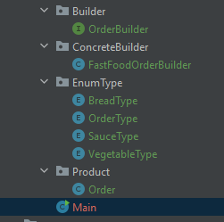

# 1. Builder Pattern là gì?
**Builder pattern** là một trong những **Creational pattern**. Builder pattern là mẫu thiết kế đối tượng được tạo ra để xây dựng một đôi tượng phức tạp bằng cách sử dụng các đối tượng đơn giản và sử dụng tiếp cận từng bước, việc xây dựng các đối tượng đôc lập với các đối tượng khác.

Builder Pattern được xây dựng để khắc phục một số nhược điểm của Factory Pattern và Abstract Factory Pattern khi mà Object có nhiều thuộc tính.

Có ba vấn đề chính với  Factory Pattern và Abstract Factory Pattern khi Object có nhiều thuộc tính:

* Quá nhiều tham số phải truyền vào từ phía client tới Factory Class.
* Một số tham số có thể là tùy chọn nhưng trong Factory Pattern, chúng ta phải gửi tất cả tham số, với tham số tùy chọn nếu không nhập gì thì sẽ truyền là null.
* Nếu một Object có quá nhiều thuộc tính thì việc tạo sẽ phức tạp.

Chúng ta có thể xử lý những vấn đề này với một số lượng lớn các tham số bằng việc cung cấp một hàm khởi tạo với những tham số bắt buộc và các method getter/ setter để cài đặt các tham số tùy chọn. Vấn đề với hướng tiếp cận này là trạng thái của Object sẽ không nhất quán cho tới khi tất cả các thuộc tính được cài đặt một cách rõ ràng. Nếu cần xây dựng một đối tượng Immutable thì cách này cũng không thể thực hiện được.

# 2. Cài đặt Builder Pattern như thế nào?

_Một builder gồm các thành phần cơ bản sau:_
* **Product** : đại diện cho đối tượng cần tạo, đối tượng này phức tạp, có nhiều thuộc tính.
* **Builder** : là abstract class hoặc interface khai báo phương thức tạo đối tượng.
* **ConcreteBuilder** : kế thừa Builder và cài đặt chi tiết cách tạo ra đối tượng. Nó sẽ xác định và nắm giữ các thể hiện mà nó tạo ra, đồng thời nó cũng cung cấp phương thức để trả các các thể hiện mà nó đã tạo ra trước đó.
* **Director/ Client**: là nơi sẽ gọi tới Builder để tạo ra đối tượng.

Trường hợp đơn giản, chúng ta có thể gộp Builder và ConcreteBuilder thành static nested class bên trong Product.

## 2.1 Ví dụ sử dụng Builder


_Product:_
```
public enum BreadType {
    SIMPLE, OMELETTE, FRIED_EGG, GRILLED_FISH, PORK, BEEF,
}
```

```
public enum OrderType {
    ON_SITE, TAKE_AWAY;
}
```

 ```
public enum SauceType {
    SOY_SAUCE, FISH_SAUCE, OLIVE_OIL, KETCHUP, MUSTARD;
}
```

```
public enum VegetableType {
    SALAD, CUCUMBER, TOMATO
}
```
```
public class Order {
 
    private OrderType orderType;
    private BreadType breadType;
    private SauceType sauceType;
    private VegetableType vegetableType;
 
    public Order(OrderType orderType, BreadType breadType, SauceType sauceType, VegetableType vegetableType) {
        super();
        this.orderType = orderType;
        this.breadType = breadType;
        this.sauceType = sauceType;
        this.vegetableType = vegetableType;
    }
 
    @Override
    public String toString() {
        return "Order [orderType=" + orderType + ", breadType=" + breadType + ", sauceType=" + sauceType
                + ", vegetableType=" + vegetableType + "]";
    }
 
    public OrderType getOrderType() {
        return orderType;
    }
 
    public BreadType getBreadType() {
        return breadType;
    }
 
    public SauceType getSauceType() {
        return sauceType;
    }
 
    public VegetableType getVegetableType() {
        return vegetableType;
    }
 
}
```
_Builder:_
```
package com.gpcoder.patterns.creational.builder.food.builder;
 
import com.gpcoder.patterns.creational.builder.food.product.order.Order;
import com.gpcoder.patterns.creational.builder.food.product.type.BreadType;
import com.gpcoder.patterns.creational.builder.food.product.type.OrderType;
import com.gpcoder.patterns.creational.builder.food.product.type.SauceType;
import com.gpcoder.patterns.creational.builder.food.product.type.VegetableType;
 
public interface OrderBuilder {
 
    OrderBuilder orderType(OrderType orderType);
 
    OrderBuilder orderBread(BreadType breadType);
 
    OrderBuilder orderSauce(SauceType sauceType);
 
    OrderBuilder orderVegetable(VegetableType vegetableType);
 
    Order build();
 
}
```
_ConcreteBuilder:_
```
package com.gpcoder.patterns.creational.builder.food.concretebuilder;
 
import com.gpcoder.patterns.creational.builder.food.builder.OrderBuilder;
import com.gpcoder.patterns.creational.builder.food.product.order.Order;
import com.gpcoder.patterns.creational.builder.food.product.type.BreadType;
import com.gpcoder.patterns.creational.builder.food.product.type.OrderType;
import com.gpcoder.patterns.creational.builder.food.product.type.SauceType;
import com.gpcoder.patterns.creational.builder.food.product.type.VegetableType;
 
public class FastFoodOrderBuilder implements OrderBuilder {
 
    private OrderType orderType;
    private BreadType breadType;
    private SauceType sauceType;
    private VegetableType vegetableType;
 
    @Override
    public OrderBuilder orderType(OrderType orderType) {
        this.orderType = orderType;
        return this;
    }
 
    @Override
    public OrderBuilder orderBread(BreadType breadType) {
        this.breadType = breadType;
        return this;
    }
 
    @Override
    public OrderBuilder orderSauce(SauceType sauceType) {
        this.sauceType = sauceType;
        return this;
    }
 
    @Override
    public OrderBuilder orderVegetable(VegetableType vegetableType) {
        this.vegetableType = vegetableType;
        return this;
    }
    
    @Override
    public Order build() {
        return new Order(orderType, breadType, sauceType, vegetableType);
    }
 
}
```
_Director:_
```
package com.gpcoder.patterns.creational.builder.food.director;
 
import com.gpcoder.patterns.creational.builder.food.concretebuilder.FastFoodOrderBuilder;
import com.gpcoder.patterns.creational.builder.food.product.order.Order;
import com.gpcoder.patterns.creational.builder.food.product.type.BreadType;
import com.gpcoder.patterns.creational.builder.food.product.type.OrderType;
import com.gpcoder.patterns.creational.builder.food.product.type.SauceType;
 
public class Client {
 
    public static void main(String[] args) {
        Order order = new FastFoodOrderBuilder()
                .orderType(OrderType.ON_SITE).orderBread(BreadType.OMELETTE)
                .orderSauce(SauceType.SOY_SAUCE).build();
        System.out.println(order);
    }
}
```
_Output của chương trình trên:_
```	
Order [orderType=ON_SITE, breadType=OMELETTE, sauceType=SOY_SAUCE, vegetableType=null]
```
## 2.2. Ví dụ sử dụng Builder để tạo đối tượng Immutable
```
package com.gpcoder.patterns.creational.builder.bank;
 
public class BankAccount {
 
    private final String name; // required
    private final String accountNumber; // required
    private final String address;
    private final String email;
    private final boolean newsletter;
    private final boolean mobileBanking;
 
    public BankAccount(String name, String accountNumber, String address, String email, boolean newsletter,
            boolean mobileBanking) {
        super();
        this.name = name;
        this.accountNumber = accountNumber;
        this.address = address;
        this.email = email;
        this.newsletter = newsletter;
        this.mobileBanking = mobileBanking;
    }
 
    // Builder class
    public static class BankAccountBuilder {
         
        private String name; // required
        private String accountNumber; // required
        private String address;
        private String email;
        private boolean newsletter;
        private boolean mobileBanking;
 
        public BankAccountBuilder(String name, String accountNumber) {
            this.name = name;
            this.accountNumber = accountNumber;
        }
 
        public BankAccountBuilder withAddress(String address) {
            this.address = address;
            return this;
        }
 
        public BankAccountBuilder withEmail(String email) {
            this.email = email;
            return this;
        }
 
        public BankAccountBuilder wantNewsletter(boolean newsletter) {
            this.newsletter = newsletter;
            return this;
        }
 
        public BankAccountBuilder wantMobileBanking(boolean mobileBanking) {
            this.mobileBanking = mobileBanking;
            return this;
        }
 
        public BankAccount build() { 
            validateUserObject();
             
            BankAccount bankAccount = new BankAccount(
                    this.name, this.accountNumber, 
                    this.address, this.email,
                    this.newsletter, this.mobileBanking);
             
            return bankAccount;
        }
 
        private void validateUserObject() {
            // Do some basic validations to check
            if (this.newsletter && email == null) {
                throw new IllegalArgumentException("Email can't be null when client want to receive the new letter");
            }
        }
    }
 
    @Override
    public String toString() {
        return "BankAccount [name=" + name + ", accountNumber=" + accountNumber + ", address=" + address + ", email="
                + email + ", newsletter=" + newsletter + ", mobileBanking=" + mobileBanking + "]";
    }
 
}
```
_Client:_
```
package com.gpcoder.patterns.creational.builder.bank;
 
public class Client {
     
    public static void main(String[] args) {
        BankAccount newAccount = new BankAccount
                  .BankAccountBuilder("GP Coder", "0123456789")
                  .withEmail("contact@gpcoder.com")
                  .wantNewsletter(true)
                  .build();
        System.out.println(newAccount);
    }
}
```
_Output của chương trình:_
```
BankAccount [name=GP Coder, accountNumber=0123456789, address=null, email=contact@gpcoder.com, newsletter=true, mobileBanking=false]
```
# 3. Lợi ích của Builder Pattern là gì?
* Hỗ trợ, loại bớt việc phải viết nhiều constructor.
* Code dễ đọc, dễ bảo trì hơn khi số lượng thuộc tính (propery) bắt buộc để tạo một object từ 4 hoặc 5 propery.
* Giảm bớt số lượng constructor, không cần truyền giá trị null cho các tham số không sử dụng.
* Ít bị lỗi do việc gán sai tham số khi mà có nhiều tham số trong constructor: bởi vì người dùng đã biết được chính xác giá trị gì khi gọi phương thức tương ứng.
* Đối tượng được xây dựng an toàn hơn: bởi vì nó đã được tạo hoàn chỉnh trước khi sử dụng.
* Cung cấp cho bạn kiểm soát tốt hơn quá trình xây dựng: chúng ta có thể thêm xử lý kiểm tra ràng buộc trước khi đối tượng được trả về người dùng.
* Có thể tạo đối tượng immutable.
* Một số ví dụ sử dụng Builder Pattern trong JDK:
* java.lang.StringBuilder.append().
* java.lang.StringBuffer.append().

# 4. Nhược điểm của Builder Pattern là gì?
* Builder Pattern có nhược điểm là duplicate code khá nhiều: do cần phải copy tất cả các thuộc tính từ class Product sang class Builder.
* Tăng độ phức tạp của code (tổng thể) do số lượng class tăng lên.

# 5. Sử dụng Builder Pattern khi nào?
* Tạo một đối tượng phức tạp: có nhiều thuộc tính (nhiều hơn 4) và một số bắt buộc (requried), một số không bắt buộc (optional).
* Khi có quá nhiều hàm constructor, bạn nên nghĩ đến Builder.
* Muốn tách rời quá trình xây dựng một đối tượng phức tạp từ các phần tạo nên đối tượng.
* Muốn kiểm soát quá trình xây dựng.
* Khi người dùng (client) mong đợi nhiều cách khác nhau cho đối tượng được xây dựng.
