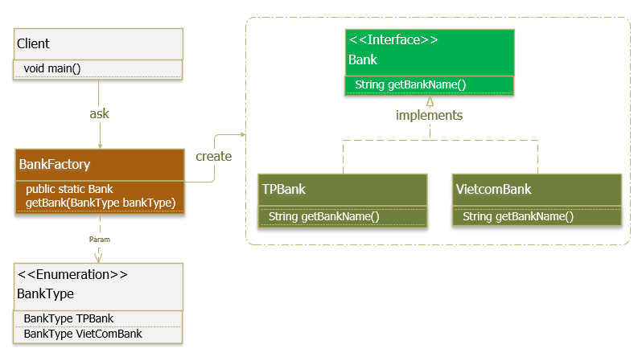

# Factory Method
# 1. Factory Method Pattern là gì?
**Factory Method Design Pattern** hay gọi ngắn gọn là **Factory Pattern** là một trong những Pattern thuộc nhóm **Creational Design Pattern**. Nhiệm vụ của Factory Pattern là quản lý và trả về các đối tượng theo yêu cầu, giúp cho việc khởi tạo đổi tượng một cách linh hoạt hơn.

**Factory Pattern** đúng nghĩa là một nhà máy, và nhà máy này sẽ “sản xuất” các đối tượng theo yêu cầu của chúng ta.

Trong **Factory Pattern**, chúng ta tạo đối tượng mà không để lộ logic tạo đối tượng ở phía người dùng và tham chiếu đến đối tượng mới được tạo ra bằng cách sử dụng một interface chung.

**Factory Pattern** được sử dụng khi có một class cha (super-class) với nhiều class con (sub-class), dựa trên đầu vào và phải trả về 1 trong những class con đó.

# 2. Cài đặt Factory Pattern như thế nào?
Một Factory Pattern bao gồm các thành phần cơ bản sau:
* **Super Class:** môt supper class trong Factory Pattern có thể là một **interface, abstract class** hay một **class** thông thường.
* **Sub Classes:** các sub class sẽ implement các phương thức của **supper class** theo nghiệp vụ riêng của nó.
* **Factory Class:** một class chịu tránh nhiệm khởi tạo các đối tượng **sub class** dựa theo tham số đầu vào. Lưu ý: lớp này là **Singleton** hoặc cung cấp một **public static method** cho việc truy xuất và khởi tạo đối tượng. Factory class sử dụng if-else hoặc switch-case để xác định class con đầu ra.

_Ví dụ:_ Tất cả hệ thống ngân hàng có cung cấp API để truy cập đến hệ thống của họ. Team được giao nhiệm vụ thiết kế một API để client có thể sử dụng dịch vụ của một ngân hàng bất kỳ. Hiện tại, phía client chỉ cần sử dụng dịch vụ của 2 ngân hàng là VietcomBank và TPBank. Tuy nhiên để dễ mở rộng sau này, và phía client mong muốn không cần phải thay đổi code của họ khi cần sử dụng thêm dịch vụ của ngân hàng khác. Với yêu cầu như vậy, chúng ta có thể sử dụng một Pattern phù hợp là Factory Method Pattern.

Hệ thống được minh họa như sau:

Chương trình được cài đặt theo Factory Pattern như sau:

**Supper Class:**

```
package org.example.Animal;
public interface IAnimal {
String GetName();
}
```
**Sub Classes:**
```package org.example.Animal;
public class Cat implements IAnimal{
    @Override
    public String GetName() {
        return "This is Cat";
    }
}
```

```
package org.example.Animal;
public class Dog implements IAnimal{
    @Override
    public String GetName() {
        return "This is Dog";
    }
}
```

```
package org.example.Animal;
public class Duck implements IAnimal{
    @Override
    public String GetName() {
        return "This is Duck";
    }
}
```
**Factory class:**
```
package org.example.Factory;
import org.example.Animal.IAnimal;
public interface IAnnimalFactory {
    IAnimal CreateAnimal();
}
```
```
import org.example.Animal.Cat;
import org.example.Animal.Dog;
import org.example.Animal.Duck;
import org.example.Animal.IAnimal;

public class BasicAnimalFactory implements IAnnimalFactory {
    int index = 0;

    @Override
    public IAnimal CreateAnimal() {
        if (index == 0) {
            index++;
            return new Duck();
        }
        if (index == 1) {
            index++;
            return new Cat();
        }
        if (index == 2) {
            index = 0;
            return new Dog();
        }
        return null;
    }
}
```
```
package org.example.Factory;
import org.example.Animal.Cat;
import org.example.Animal.Dog;
import org.example.Animal.Duck;
import org.example.Animal.IAnimal;
import java.util.Random;
public class RandomAnimalFactory implements IAnnimalFactory {
    @Override
    public IAnimal CreateAnimal() {
        int type = new Random().nextInt(0, 3);
        if (type == 0) {
            return new Dog();
        } else if (type == 1) {
            return new Cat();
        } else {
            return new Duck();
        }
    }
}
```
**Client:**
```
package org.example;

import org.example.Animal.IAnimal;
import org.example.Factory.BasicAnimalFactory;
import org.example.Factory.IAnnimalFactory;
import org.example.Factory.RandomAnimalFactory;

import java.io.Console;
import java.util.Random;

public class Main {
    public static void main(String[] args) {
        IAnnimalFactory iAnnimalFactory;
        System.gc();
        int random = new Random().nextInt(0, 2);
        if (random == 0) {
            iAnnimalFactory = new BasicAnimalFactory();
        } else {
            iAnnimalFactory = new RandomAnimalFactory();
        }
        System.out.println(random);
        System.out.println(iAnnimalFactory.CreateAnimal().GetName());
        System.out.println(iAnnimalFactory.CreateAnimal().GetName());
        System.out.println(iAnnimalFactory.CreateAnimal().GetName());
        System.out.println(iAnnimalFactory.CreateAnimal().GetName());
        System.out.println(iAnnimalFactory.CreateAnimal().GetName());

    }
}
```
Như bạn thấy, phía client chỉ cần gọi duy nhất một phương thức iAnnimalFactory.GetName() là có thể sử gọi ra các lớp con vật bất kỳ.

Khi hệ thống muốn cung cấp thêm con vật của một animal khác, chẳng hạn Pig, thì cần tạo thêm một class mới implement từ interface Animal, và thêm vào logic khởi tạo Bank trong Factory là xong. Nó không làm ảnh hưởng đến code ở phía Client.

# 3. Sử dụng Factory Pattern khi nào?
_Factory Pattern được sử dụng khi:_
* Chúng ta có một super class với nhiều class con và dựa trên đầu vào, chúng ta cần trả về một class con. Mô hình này giúp chúng ta đưa trách nhiệm của việc khởi tạo một lớp từ phía người dùng (client) sang lớp Factory.
* Chúng ta không biết sau này sẽ cần đến những lớp con nào nữa. Khi cần mở rộng, hãy tạo ra sub class và implement thêm vào factory method cho việc khởi tạo sub class này.
# 4. Lợi ích của Factory Pattern là gì?

_Lợi ích của Factory Pattern:_
* Factory Pattern giúp giảm sự phụ thuộc giữa các module (loose coupling): cung cấp 1 hướng tiếp cận với Interface thay thì các implement. Giúp chuơng trình độc lập với những lớp cụ thể mà chúng ta cần tạo 1 đối tượng, code ở phía client không bị ảnh hưởng khi thay đổi logic ở factory hay sub class.
* Mở rộng code dễ dàng hơn: khi cần mở rộng, chỉ việc tạo ra sub class và implement thêm vào factory method.
* Khởi tạo các Objects mà che giấu đi xử lí logic của việc khởi tạo đấy. Người dùng không biết logic thực sực được khởi tạo bên dưới phương thức factory.
* Dễ dạng quản lý life cycle của các Object được tạo bởi Factory Pattern.
* Thống nhất về naming convention: giúp cho các developer có thể hiểu về cấu trúc source code.
Bạn có thể thấy Factory Pattern được áp dụng trong:
* JDK: java.util.Calendar, ResourceBundle, NumberFormat, …
* BeanFactory trong Spring Framework.
* SessionFactory trong Hibernate Framework.
* …


