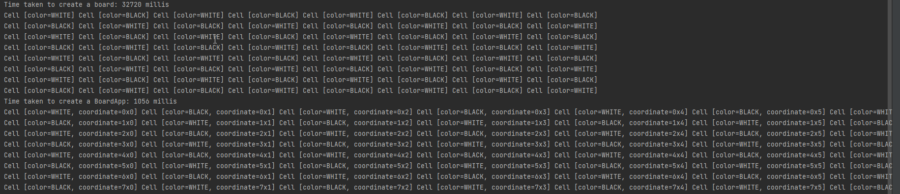

# **1. Prototype Pattern là gì?**
**Prototype pattern** là một trong những **Creational pattern**.
Nó có nhiệm vụ khởi tạo một đối tượng bằng cách **clone** một đối tượng đã tồn tại thay vì khởi tạo với từ khoá new.
Đối tượng mới là một bản sao có thể giống 100% với đối tượng gốc,
chúng ta có thể thay đổi dữ liệu của nó mà không ảnh hưởng đến đối tượng gốc.

**Prototype Pattern** được dùng khi việc tạo một object tốn nhiều chi phí và thời gian trong khi bạn đã có một object tương tự tồn tại.

Trong Java cung cấp mẫu prototype pattern này bằng việc implement interface **Cloneable** và sử dụng method **clone()** để tạo object có đầy đủ thuộc tính của đối tượng ban đầu. Các bạn có thể xem lại bài viết về O**bject cloning** trong java để hiểu thêm về interface Clonable trước khi tiếp tục xem phần tiếp theo của bài viết này.

# **2. Cài đặt Prototype Pattern như thế nào?**

_Một Prototype Pattern gồm các thành phần cơ bản sau:_

* **Prototype** : khai báo một class, interface hoặc abtract class cho việc clone chính nó.
* **ConcretePrototype class** : các lớp này thực thi interface (hoặc kế thừa từ lớp abstract) được cung cấp bởi Prototype để copy (nhân bản) chính bản thân nó. Các lớp này chính là thể hiện cụ thể phương thức clone(). Lớp này có thể không cần thiết nếu: Prototype là một class và nó đã implement việc clone chính nó.
* **Client class** : tạo mới object bằng cách gọi Prototype thực hiện clone chính nó.

## **2.1. Ví dụ 1**
_Ví dụ_: Một công ty có cấu hình máy tính đều giống nhau cho tất cả nhân viên, bao gồm: Hệ điều hành (os), Phần mềm văn phòng (office), Phần mềm diệt virus (antivirus), Trình duyệt (Browser), và một số phần mềm khác (others) tùy theo nhu cầu của mỗi nhân viên sẽ được cài đặt thêm. Việc cài đặt tất cả phần mềm trên rất tốn thời gian, nên anh IT đã nghĩ ra một cách là sẽ tạo ra một bản chuẩn cho một máy tính và có thể clone() lại cấu hình đó cho một nhân viên khác mà không cần phải cài đặt lại từ đầu.

_Cách làm này được minh họa như sau:_
* Đầu tiên, chúng ta sẽ tạo một lớp Computer và implement từ interface Cloneable.
* Tiếp theo, chúng ta sẽ tạo một computer chuẩn (instance).
* Sau đó, mỗi khi có nhân viên mới, chỉ việc clone() từ computer chuẩn đã tạo. Tùy theo, nhu cầu của mỗi nhân viên có thể thay đổi lại cho phù hợp (setOthers()).


Computer:
```
package org.example;

public class Computer implements Cloneable {
    private String os;
    private String office;
    private String antivirus;
    private String browser;
    private String others;

    public Computer(String os, String office, String antivirus, String browser, String other) {
        super();
        this.os = os;
        this.office = office;
        this.antivirus = antivirus;
        this.browser = browser;
        this.others = other;
    }

    @Override
    protected Computer clone() {
        try {
            return (Computer) super.clone();
        } catch (CloneNotSupportedException ex) {
            ex.printStackTrace();
        }
        return null;
    }
    @Override
    public  String toString()
    {
        return "Computer [os=" + os + ", office=" + office + ", antivirus=" + antivirus + ", browser=" + browser
                + ", others=" + others + "]";
    }
    public  void  setOthers(String others)
    {
        this.others = others;
    }
}

```

main:
```
package org.example;

public class Main {
    public static void main(String[] args) {
        System.out.println("Hello world!");
        Computer computer1 = new Computer("Window 10", "Word 2013", "BKAV", "Chrome v69", "Skype");
        Computer computer2 = computer1.clone();
        computer2.setOthers("Skype, Teamviewer, FileZilla Client");
        System.out.println(computer1);
        System.out.println(computer2);
    }
}
```
kết quả:


## **2.2. Ví dụ 2**
Một ví dụ khác về **Prototype Pattern** hơi phức tạp hơn để các bạn có thể thấy rõ được lợi ích của Prototype và việc kết hợp Prototype như thế nào trong **Factory Method Pattern**.

Ví dụ: Một bàn cờ vua gồm có: 8 hàng (row) và 8 cột (column). Tương ứng với hàng và cột là các ô (cell) được tô màu đen (black) và trắng (white). Chúng ta, hãy xem các cách implement để vẽ bàn cờ vua như sau:

Tạo ra 1 class Cell:
```
package org.example;

import java.util.concurrent.TimeUnit;

public class Cell {
    private String color;
    private String coordinate;
    public Cell(String color) {
        this.color = color;
        try {
            // More time to create an cell
            TimeUnit.MILLISECONDS.sleep(10);
        } catch (InterruptedException e) {
            e.printStackTrace();
        }
    }
    @Override
    public String toString() {
        return "Cell [color=" + color + "]";
    }
}

```
Tạo enum:
```
package org.example;

public enum Color {
    BLACK, WHITE;
}
```

Tạo ra 1 class Board:
```
package org.example;

public class Board {
    public static final int NO_OF_ROWS = 8;
    public static final int NO_OF_COLUMNS = 8;
    private final Cell[][] board;
    public Board() {
        this.board = new Cell[NO_OF_ROWS][NO_OF_COLUMNS];
        Cell cell;
        for (int row = NO_OF_ROWS - 1; row >= 0; row--) {
            for (int col = NO_OF_COLUMNS - 1; col >= 0; col--) {
                if ((row + col) % 2 == 0) {
                    cell = new Cell(Color.WHITE.name());
                } else {
                    cell = new Cell(Color.BLACK.name());
                }
                board[row][col] = cell;
            }
        }
    }
    public void print() {
        for (int row = 0; row < NO_OF_ROWS; row++) {
            for (int col = 0; col < NO_OF_COLUMNS; col++) {
                System.out.print(board[row][col] + " ");
            }
            System.out.println();
        }
    }
}
```
Chạy hàm main:
```
        long startTime = System.currentTimeMillis();
        Board chessBoard = new Board();
        long endTime = System.currentTimeMillis();
        System.out.println("Time taken to create a board: " + (endTime - startTime) + " millis");
        chessBoard.print();
```
Kết quả thực hiện:

Như bạn thấy, thời gian thực hiện rất lâu (1155ms). Nhìn vào chương trình trên, bạn sẽ dễ dàng thấy được là chương trình thực hiện lâu do việc tạo Cell, và mỗi cell chỉ có 2 loại là Cell màu trắng và Cell màu đen. Chương trình trên được sửa lại như sau:

Chúng ta sẽ sử dụng một lớp Factory Method Pattern để quản lý việc khởi tạo đối tượng. Trong lớp này, chúng ta sẽ tạo một Map để lưu giữ các đối tượng đã khởi tạo theo loại tương ứng.
_Cell:_
```
package org.example.Vidu3;

import java.util.concurrent.TimeUnit;

public class CellProduct implements Cloneable {
    private String color;
    private String coordinate;

    public CellProduct(String color) {
        // Do more time to create an cell
        this.color = color;
        try {
            TimeUnit.MILLISECONDS.sleep(500);
        } catch (InterruptedException e) {
            e.printStackTrace();
        }
    }
    public void setCoordinate(String coordinate) {
        this.coordinate = coordinate;
    }
    @Override
    public String toString() {
        return "Cell [color=" + color + ", coordinate=" + coordinate + "]";
    }
    @Override
    protected CellProduct clone() {
        try {
            return (CellProduct) super.clone();
        } catch (CloneNotSupportedException e) {
            e.printStackTrace();
        }
        return null;
    }
}

```

_CellFactory:_
```
package com.gpcoder.patterns.creational.prototype.board2;
 
import java.util.HashMap;
import java.util.Map;
 
import com.gpcoder.patterns.creational.prototype.board1.Color;
 
public class CellFactory {
 
    private static final Map<Color, Cell> CELL_CACHE = new HashMap<>();
     
    private CellFactory() {
         
    }
 
    public static Cell getCell(Color color) {
        if (!CELL_CACHE.containsKey(color)) {
            Cell cell = new Cell(color.name());
            CELL_CACHE.put(color, cell);
        }
        return CELL_CACHE.get(color);
    }
}
```
_Hàm khởi tạo Board được viết lại như sau:_
```
public Board() {
    this.board = new Cell[NO_OF_ROWS][NO_OF_COLUMNS];
    Cell cell;
    for (int row = NO_OF_ROWS - 1; row >= 0; row--) {
        for (int col = NO_OF_COLUMNS - 1; col >= 0; col--) {
            if ((row + col) % 2 == 0) {
                cell = CellFactory.getCell(Color.WHITE);
            } else {
                cell = CellFactory.getCell(Color.BLACK);
            }
            board[row][col] = cell;
        }
    }
}
```
_Thực thi chương trình trên lại, chúng ta có kết quả như sau:_

Như bạn thấy, bây giờ chương trình của chúng ta nhanh lên rất nhiều (26ms) nhờ vào việc implement một đối tượng để cache việc khởi tạo Cell.

Chương trình trên khá tốt, tuy nhiên, nếu bây giờ lớp Cell cần quản lý thêm coordinate và mỗi cell khác nhau sẽ có giá trị khác nhau. Nếu sử dụng với như trên thì khi thay đổi giá trị của một coordinate thì đối tượng gốc cũng bị thay đổi theo. Để giải quyết vấn đề này chúng ta sẽ implement thêm một interface Clonaeble cho class Cell.

Như bạn thấy, sau khi áp dụng Prototype thì chúng ta có thể thay đổi giá trị mà không ảnh hưởng đến đối tượng gốc.

# **3. Lợi ích của Prototype Pattern là gì?**
* Cãi thiện performance: giảm chi phí để tạo ra một đối tượng mới theo chuẩn, điều này sẽ làm tăng hiệu suất so với việc sử dụng từ khóa new để tạo đối tượng mới.
* Giảm độ phức tạp cho việc khởi tạo đối tượng: do mỗi lớp chỉ implement cách clone của chính nó.
* Giảm việc phân lớp, tránh việc tạo nhiều lớp con cho việc khởi tạo đối tượng như của Abstract Factory Pattern.
* Khởi tạo object mới bằng cách thay đổi một vài thuộc tính của object (các object có ít điểm khác biệt nhau): Một hệ thống linh động sẽ để cho chúng ta tự định nghĩa một hành động nào đó thông qua sự kết hợp với một object (nghĩa là một phương thức của một class) hơn là định nghĩa một class mới.
* Khởi tạo object mới bằng cách thay đổi cấu trúc: Rất nhiều ứng dụng xây dựng hệ thống từ nhiều phần và các phần con. Các phần con lại khởi tạo từ nhiều phần con khác (chia nhỏ bài toán). Prototype pattern cũng hỗ trợ điều này. Nghĩa là các phần đó có thể được khởi tạo từ việc copy một nguyên mẫu từ một “cấu trúc” khác. Miễn là các phần kết hợp đều thể hiện clone() và được sử dụng với cấu trúc khác nhau làm nguyên mẫu. Xem thêm về Object cloning trong java bạn sẽ thấy rõ điều này.

# **4. Sử dụng Prototype khi nào?**
* Chúng ta có một object và cần phải tạo 1 ọbject mới khác dựa trên object bạn đầu mà không thể sử dụng toán tử new hay các hàm contructor để khởi tạo. Vì sao vậy? Lý do đơn giản là ở đây chúng ta ko hề được biết thông tin nội tại của object đó hoặc object đó đã có thể bị che dấu đi nhiều thông tin khác mà chỉ cho ta một thông tin rất giới hạn không đủ để hiểu được. Do vậy ta ko thể dùng toán tử new để khởi tạo nó được. Giải pháp: để cho chính object mẫu tự xác định thông tin và dữ liệu sao chép.
* Khởi tạo đối tượng lúc run-time: chúng ta có thể xác định đối tượng cụ thể sẽ được khởi tạo lúc runtime nếu class được implement / extend từ một Prototype.
* Cấu hình một ứng dụng với dynamic class.
* Muốn truyền đối tượng vào một hàm nào đó để xử lý, thay vì truyền đối tượng gốc có thể ảnh hưởng dữ liệu thì ta có thể truyền đối tượng sao chép.
* Chi phí của việc tạo mới đối tượng (bằng cách sử dụng toán tử new) là lớn.
* Ẩn độ phức tạp của việc khởi tạo đối tượng từ phía Client.