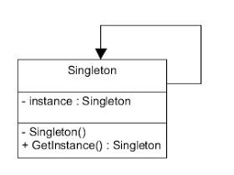
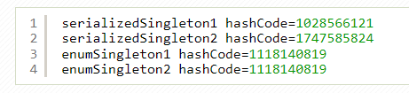

# _1. Singleton Pattern là gì?_
**Singleton** là 1 trong 5 design pattern của nhóm **Creational Design Pattern.**

**Singleton** đảm bảo chỉ duy nhất **một thể hiện (instance)** được tạo ra và nó sẽ cung cấp cho bạn một method để có thể truy xuất được thể hiện duy nhất đó mọi lúc mọi nơi trong chương trình.



Sử dụng Singleton khi chúng ta muốn:

* Đảm bảo rằng chỉ có một instance của lớp.
* Việc quản lý việc truy cập tốt hơn vì chỉ có một thể hiện duy nhất.
* Có thể quản lý số lượng thể hiện của một lớp trong giớn hạn chỉ định.

# _2. Implement Singleton Pattern như thế nào?_
Có rất nhiều cách để implement Singleton Pattern. Nhưng dù cho việc implement bằng cách nào đi nữa cũng dựa vào nguyên tắc dưới đây cơ bản dưới đây:
* private constructor để hạn chế truy cập từ class bên ngoài.
* Đặt private static final variable đảm bảo biến chỉ được khởi tạo trong class.
* Có một method public static để return instance được khởi tạo ở trên.

# _3.Những cách nào để implement Singleton Pattern_

  Dựa trên những nguyên tắc thiết kế Singleton ở trên, chúng ta có các cách implement singleton như sau:

##   3.1 Eager initialization
ingleton Class được khởi tạo ngay khi được gọi đến. Đây là cách dễ nhất nhưng nó có một nhược điểm mặc dù instance đã được khởi tạo mà có thể sẽ không dùng tới.

_Ví dụ:_
```
package com.gpcoder.patterns.creational.singleton;
public class EagerInitializedSingleton {
    private static final EagerInitializedSingleton INSTANCE = new EagerInitializedSingleton();
    // Private constructor to avoid client applications to use constructor
    private EagerInitializedSingleton() {
    }
    public static EagerInitializedSingleton getInstance() {
        return INSTANCE;
    }
}
```
## 3.2 Static block initialization
Cách làm tương tự như Eager initialization chỉ khác phần static block cung cấp thêm lựa chọn cho việc handle exception hay các xử lý khác.

_Ví dụ:_
```
package com.gpcoder.patterns.creational.singleton;
public class StaticBlockSingleton {
    private static final StaticBlockSingleton INSTANCE;
    private StaticBlockSingleton() {
    }
    // Static block initialization for exception handling
    static {
        try {
            INSTANCE = new StaticBlockSingleton();
        } catch (Exception e) {
            throw new RuntimeException("Exception occured in creating singleton instance");
        }
    }
    public static StaticBlockSingleton getInstance() {
        return INSTANCE;
    }
}
```

## 3.3 Lazy Initialization

Là một cách làm mang tính mở rộng hơn so với 2 cách làm trên và hoạt động tốt trong môi trường đơn luồng (single-thread).
```
package com.gpcoder.patterns.creational.singleton;
 
public class LazyInitializedSingleton {
 
    private static LazyInitializedSingleton instance;
 
    private LazyInitializedSingleton() {
    }
 
    public static LazyInitializedSingleton getInstance() {
        if (instance == null) {
            instance = new LazyInitializedSingleton();
        }
        return instance;
    }
}
```
Cách này đã khắc phục được nhược điểm của cách Eager initialization, chỉ khi nào getInstance() được gọi thì instance mới được khởi tạo. Tuy nhiên, cách này chỉ sử dụng tốt trong trường hợp đơn luồng (single-thread), trường hợp nếu có nhiều luồng (multi-thread) cùng chạy và cùng gọi hàm getInstance() tại cùng một thời điểm thì có thể có nhiều hơn 1 thể hiện của instance. Để khắc phục nhược điểm này chúng ta sử dụng Thread Safe Singleton.

Một nhược điểm nữa của Lazy Initialization cần quan tâm là: đối với thao tác create instance quá chậm thì người dùng có phải chờ lâu cho lần sử dụng đầu tiên.

## 3.4 Thread Safe Singleton

Cách đơn giản nhất là chúng ta gọi phương thức synchronized của hàm getInstance() và như vậy hệ thống đảm bảo rằng tại cùng một thời điểm chỉ có thể có 1 luồng có thể truy cập vào hàm getInstance() và đảm bảo rằng chỉ có duy nhất 1 thể hiện của class.

_Ví dụ:_
```
package com.gpcoder.patterns.creational.singleton;
 
public class ThreadSafeLazyInitializedSingleton {
 
    private static volatile ThreadSafeLazyInitializedSingleton instance;
 
    private ThreadSafeLazyInitializedSingleton() {
    }
 
    public static synchronized ThreadSafeLazyInitializedSingleton getInstance() {
        if (instance == null) {
            instance = new ThreadSafeLazyInitializedSingleton();
        }
        return instance;
    }
}
```
Biến volatile trong Java có tác dụng thông báo sự thay đổi giá trị của biến tới các thread khác nhau nếu biến này đang được sử dụng trong nhiều thread.

Cách này có nhược điểm là một phương thức synchronized sẽ chạy rất chậm và tốn hiệu năng, bất kỳ Thread nào gọi đến đều phải chờ nếu có một Thread khác đang sử dụng. Có những tác vụ xử lý trước và sau khi tạo thể hiện không cần thiết phải block. Vì vậy chúng ta cần cải tiến nó đi 1 chút với Double Check Locking Singleton.

## 3.5 Double Check Locking Singleton

Để implement theo cách này, chúng ta sẽ kiểm tra sự tồn tại thể hiện của lớp, với sự hổ trợ của đồng bộ hóa, hai lần trước khi khởi tạo. Phải khai báo volatile cho instance để tránh lớp làm việc không chính xác do quá trình tối ưu hóa của trình biên dịch.
```
package com.gpcoder.patterns.creational.singleton;
 
public class DoubleCheckLockingSingleton {
 
    private static volatile DoubleCheckLockingSingleton instance;
 
    private DoubleCheckLockingSingleton() {
    }
 
    public static DoubleCheckLockingSingleton getInstance() {
        // Do something before get instance ...
        if (instance == null) {
            // Do the task too long before create instance ...
            // Block so other threads cannot come into while initialize
            synchronized (DoubleCheckLockingSingleton.class) {
                // Re-check again. Maybe another thread has initialized before
                if (instance == null) {
                    instance = new DoubleCheckLockingSingleton();
                }
            }
        }
        // Do something after get instance ...
        return instance;
    }
}
```

## 3.6 Bill Pugh Singleton Implementation
Với cách làm này bạn sẽ tạo ra static nested class với vai trò 1 Helper khi muốn tách biệt chức năng cho 1 class function rõ ràng hơn. Đây là cách thường hay được sử dụng và có hiệu suất tốt (theo các chuyên gia đánh giá 🙂 ).
```
package com.gpcoder.patterns.creational.singleton;
 
public class BillPughSingleton {
 
    private BillPughSingleton() {
    }
 
    public static BillPughSingleton getInstance() {
        return SingletonHelper.INSTANCE;
    }
 
    private static class SingletonHelper {
        private static final BillPughSingleton INSTANCE = new BillPughSingleton();
    }
}
```
Khi Singleton được tải vào bộ nhớ thì SingletonHelper chưa được tải vào. Nó chỉ được tải khi và chỉ khi phương thức getInstance() được gọi. Với cách này tránh được lỗi cơ chế khởi tạo instance của Singleton trong Multi-Thread, performance cao do tách biệt được quá trình xử lý. Do đó, cách làm này được đánh giá là cách triển khai Singleton nhanh và hiệu quả nhất.

## 3.7 Phá vỡ cấu trúc Singleton Pattern bằng Reflection

Reflection có thể được dùng để phá vỡ Pattern của Eager Initialization ở trên.

_Ví dụ:_
```
package com.gpcoder.patterns.creational.singleton;
 
import java.lang.reflect.Constructor;
import java.lang.reflect.InvocationTargetException;
 
public class ReflectionBreakSingleton {
 
    public static void main(String[] args)
            throws InstantiationException, IllegalAccessException, InvocationTargetException {
         
        EagerInitializedSingleton instanceOne = EagerInitializedSingleton.getInstance();
        EagerInitializedSingleton instanceTwo = null;
 
        Constructor<?>[] constructors = EagerInitializedSingleton.class.getDeclaredConstructors();
        for (Constructor<?> constructor : constructors) {
            constructor.setAccessible(true);
            instanceTwo = (EagerInitializedSingleton) constructor.newInstance();
        }
 
        System.out.println(instanceOne.hashCode());
        System.out.println(instanceTwo.hashCode());
    }
}
```
_Output của chương trình:_


Tương tự Eager Initialization, implement theo Bill Pugh Singleton cũng bị break bởi Reflection.

## 3.8. Enum Singleton

Khi dùng enum thì các params chỉ được khởi tạo 1 lần duy nhất, đây cũng là cách giúp bạn tạo ra Singleton instance.

_Ví dụ:_
```
package com.gpcoder.patterns.creational.singleton;
 
/**
 * Singleton implementation using enum initialization
 */
public enum EnumSingleton {
 
    INSTANCE;
}
```
_Lưu ý:_

* Enum có thể sử dụng như một Singleton, nhưng nó có nhược điểm là không thể extends từ một lớp được, nên khi sử dụng cần xem xét vấn đề này.
* Hàm constructor của enum là lazy, nghĩa là khi được sử dụng mới chạy hàm khởi tạo và nó chỉ chạy duy nhất một lần. Nếu muốn sử dụng như một eager singleton thì cần gọi thực thi trong một static block khi start chương trình. 

## 3.9.Serialization and Singleton

  Đôi khi trong các hệ thống phân tán (distributed system), chúng ta cần implement interface Serializable trong lớp Singleton để chúng ta có thể lưu trữ trạng thái của nó trong file hệ thống và truy xuất lại nó sau.
```
package com.gpcoder.patterns.creational.singleton;
 
import java.io.ObjectStreamException;
import java.io.Serializable;
 
public class SerializedSingleton implements Serializable {
 
    private static final long serialVersionUID = 1741825395699241705L;
 
    private SerializedSingleton() {
    }
 
    private static class SingletonHelper {
        private static final SerializedSingleton instance = new SerializedSingleton();
    }
 
    public static SerializedSingleton getInstance() {
        return SingletonHelper.instance;
    }
     
    /**
     * Special hook provided by serialization where developer can control what object needs to sent.
     * However this method is invoked on the new object instance created by de serialization process.
     *
     * @return
     * @throws ObjectStreamException
     */
//    private Object readResolve() throws ObjectStreamException {
//        return SingletonHelper.instance;
//    }
 
}
```
_Đoạn code test quá trình Serialize/ Deserialize:_
```
package com.gpcoder.patterns.creational.singleton;
 
import java.io.FileInputStream;
import java.io.FileNotFoundException;
import java.io.FileOutputStream;
import java.io.IOException;
import java.io.ObjectInput;
import java.io.ObjectInputStream;
import java.io.ObjectOutput;
import java.io.ObjectOutputStream;
 
public class SingletonSerializedTest {
 
    public static void main(String[] args) throws FileNotFoundException, IOException, ClassNotFoundException {
 
        SerializedSingleton serializedSingleton1 = SerializedSingleton.getInstance();
        EnumSingleton enumSingleton1 = EnumSingleton.INSTANCE;
 
        ObjectOutput out = new ObjectOutputStream(new FileOutputStream("SingletonSerializedTest.txt"));
        out.writeObject(serializedSingleton1);
        out.writeObject(enumSingleton1);
        out.close();
 
        // De-serialize from file to object
        ObjectInput in = new ObjectInputStream(new FileInputStream("SingletonSerializedTest.txt"));
        SerializedSingleton serializedSingleton2 = (SerializedSingleton) in.readObject();
        EnumSingleton enumSingleton2 = (EnumSingleton) in.readObject();
        in.close();
 
        System.out.println("serializedSingleton1 hashCode=" + serializedSingleton1.hashCode());
        System.out.println("serializedSingleton2 hashCode=" + serializedSingleton2.hashCode());
        System.out.println("enumSingleton1 hashCode=" + enumSingleton1.hashCode());
        System.out.println("enumSingleton2 hashCode=" + enumSingleton2.hashCode());
    }
}
```
_utput của chương trình:_



Như trong ví dụ trên, Deserialize đối tượng của SerializedSingleton khác với đối tượng gốc. Tuy nhiên vấn đề này không xảy ra khi sử dụng enum.

Thực tế thì vẫn có cách khắc phục khi sử dụng class SerializedSingleton là implement một phương thức readResolve(). Nhưng khi chúng ta thật sự gặp vấn đề và cần sử dụng Serialize/ Deserialize, thì nên sử dụng enum sẽ đơn giản hơn.

# 4. Sử dụng Singleton Pattern khi nào?

Dưới đây là một số trường hợp sử dụng của Singleton Pattern thường gặp:

* Vì class dùng Singleton chỉ tồn tại 1 Instance (thể hiện) nên nó thường được dùng cho các trường hợp giải quyết các bài toán cần truy cập vào các ứng dụng như: Shared resource, Logger, Configuration, Caching, Thread pool, …
* Một số design pattern khác cũng sử dụng Singleton để triển khai: Abstract Factory, Builder, Prototype, Facade,…
* Đã được sử dụng trong một số class của core java như: java.lang.Runtime, java.awt.Desktop.
# 5.Tổng kết

  Có rất nhiều cách implement cho Singleton, mình thường sử dụng BillPughSingleton vì có hiệu suất cao, sử dụng LazyInitializedSingleton cho những ứng dụng chỉ làm việc với ứng dụng single-thread và sử dụng DoubleCheckLockingSingleton khi làm việc với ứng dụng multi-thread. Tùy theo trường hợp cụ thể, bạn hãy chọn cho mình cách implement phù hợp.